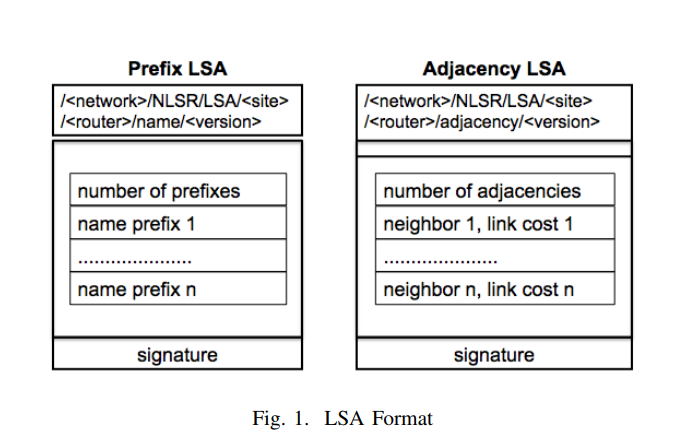
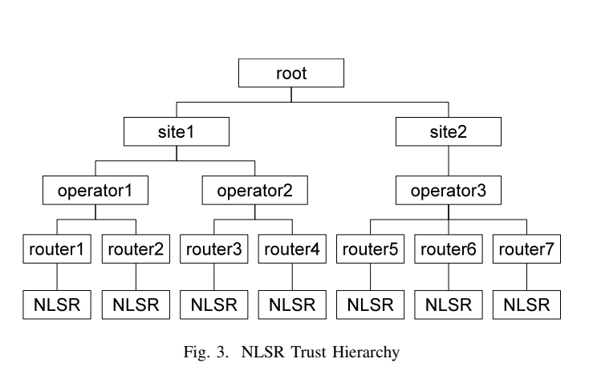

# Networking Named Content [Van Jacobson](https://named-data.net/wp-content/uploads/Jacob.pdf)
- Current internet methodology still based on host-host connection abstraction (telephone net)
- Uses **interest packets** to allow node to express interest in a named piece of data to network
- **Data packets** satisfy these interest packets and are returned to the consumer

## CCN Node Model
### Forwarding Informatio Base (FIB)
### Content Store
### Pending Interests Table

## Intro to NDN [YouTube](https://www.youtube.com/watch?v=-9dH2ikl8Zk&feature=youtu.be)
- Host based comms don't work well in vehicular networks
- Network layer can't really support Multicase / mobility / multicast forwarding (spanning tree next hop)
- NDN has same abstraction (using same name) at app layer and network layer
- NDN secure the data itself, not the connection
	- Data centric security: how do we know the data we get back is really what we want
	- All data has cryptographic signature
	- Data signed by the producers private key
	- Data can come from anywhere as we can easily determine if the data is legit
- Producers of data advertise their prefixes to their network when they come online
	- Routers know where to pass interest packets on to
	- Routers cache data (LRU as opposed to dropping data once its been sent out of interface)
- NDN can be built upon anything (IP, TCP, UDP, Blutooth, 802.11 etc)
- End-to-End Security in NDN  is application to application not host to host.
- New Things in NDN:
	- Sync: multiple parties in distributed app keep synchronized state
		- TCP / UDP / SMTP etc all only support 1:1 communication
		- No address --> How do we ensure all users (eg in a chat room) have the same data?
			- Set reconciliation between participants that syncs data in a namespace
			- Use a digest of their current data (hash) and exchange these to detect missing data
	- Repo: persistent storage across network (instead of just opurtunistic caching)
		- Producer can go offline
		- Producers produce data which is stored by Repos (Servers)
		- Data can be served by repos

# [Security Support in NDN](https://named-data.net/wp-content/uploads/2018/04/ndn-0057-2-ndn-security.pdf)
- Retrieval of *secured* data packets instead of delivery of packets between hosts
- Data is secured directly at Network Layer
- *"From 10,000 feet, one could view the basic idea of NDN as shifting HTTP’s request (for a named data object)-andresponse (with the object) semantics to the network layer [1]"*
- NDN packets are immutable
- At time of creation, producer uses its key to sign the data and this sig is stored in the NDN packet
	- This binds the **name** of the data to the **content** of the data
	- This whole thing can also be encrypted if needed
- Each name (e.g. /com/stefanolupo/desktop) must generate a key pair.
	- An NDN certificate then binds the public key to that name
		- Certifies user's ownership of that name and the key
		- Certified names are known as **identities**
- **User's must know which keys can legitmately sign what data
## Trust Authorities
- Certificate authority for a given namespace
- Allows users to get certs for a given namespace (e.g. /com/stefnaolupo)
- Typically done using commercial certificate authorities (LetsEncrypt) or global trust anchors (DNSSEC)
- NDN does things differently (Simple Distributed Security Infrastructure)
	- Each networked system (e.g. a smart home or university) establishses its own trust anchos
	- Entities under this network use this trust anchor
## Trust Policies
- Applciations define trust policies to determine whether a packet or identity is trustworthy or not
...
### NDN Certificates
- These are just typical NDN Data packets carrrying public key info and can be fetched with interest packets
- Use the following convention: `/<prefix>/KEY/<key-id>/<issuer-info>/<cert-version>`
...

### NDNFit Case Study
- **Security Bootstrapping**: system needs to be initialized by sec bootstraping before it can function
- Allows entities to obtain trust anchors, certs and trust policies
- **Trust Anchor**
	- Alice controls the entire system here so trust anchor is her certificate `/ndnfit/alice/KEY/key001/ndnfit-agent/version`
	- Entities will trust Alice (the certificate signer)
	- This will allow entities to discover other authentic entities
	- Assume we can set up trust anchor securly (out of bound)
	- Other entities in this case are "Sensor" and "Analyzer"
		- Simple naive way is to just manually install Alice's cert to Sensor and Analyzer (they both trust her now)
- **Obtaining Certificates**
	- Sensor must establish ownership of `/ndnfit/alice/sensor` (needs a cert)
	- How this is done is up to application programmer
	- In this case we're using NDNCERT daemon (the _agent_)
		- Alice controls namespace for `/ndnfit/alice` (she is the CA for that namespace)
	- Same for Analyzer
	- Sensor and Analyzer use the NDNCERT protocol to obtain certs from this agent
	- Sensor gets `/ndnfit/alice/sensor/KEY/1/alice-agent/<version>` and Analyzer gets `/ndnfit/alice/analyzer/KEY/1/alice-agent/<version>`
- **Trust Policies**
	- These can be dynamically acquired from the trust anchor (better / easy to change)
	- Or they can just be pre configured
	- These define what packets to trust based on the _packet name_, the _signing key name_, the _relationship betweenthe two names_, and the _trust anchor_  
- **Trust Schemas**
	- Use NDN naming conventions to enable descriptions of trust policies
		- How data packets must be structured
		- How packet signing key Names must be structured
		- How data packet names relate to packet signing key names
		- Which trust anchors are acceptable
	- On receipt of packet, app uses trust schemas to check trustworthiness, even before any crypto checks
	- E.g. schema 1 (stricter) only accepts packets:
		- Name prefix is `/ndnfit/alice`
		- Signing prefix is `/ndnfit/alice/KEY`
		- Certificate chain ends with trust anchor `/ndnfit/alice`
	- E.g. schema 2 (looser) only accepts:
		- Name prefix `/ndnfit`
		- Signing prefix is `/ndnfit`
		- Eventually signed by `/ndnfit`
		- **Looser schema and will accept packets from Bob and Alice**
**_Note: Interest packets can also be signed in the exact same way_**
	- E.g. a controller for a smart home IoT device
	- Wan't to be sure commands (expressed as interest) are from legit source
- **Confidentiality (Encryption)**
	- Point to point comms can use standard encryption methods (e.g. diffie helman key exchanges etc)
	- However this is inefficient for producer / multiple consumer situation
	- Can use Named Access Control (NAC)
		- Name of key used for data encryption is appended to name of data
		- `/ndnfit/alice/sensor/data/ENCRYPTED-BY/ndnfit/alice/E-KEY/sensor
	- Alice generates a key pair: `E-KEY` and `D-KEY`.
		- Data packet containing `E-KEY` is then produced (`/ndnfit/alice/E-KEY/sensor`)
		- Data packet containing `D-KEY` is produced encrypted with Analyzer's public key (`/ndnfit/alice/D-KEY/analyzer/ENCRYPTED-BY/ndnfit/alice/analyzer`)
	- For sensor to produce data:
		- Generates symmetric key for content encryption
		- Fetches `E-KEY` and encrypts the symmetric key with it
		- Packs encrypted sym key into a Data packet with name `/ndnfit/alice/sensor/data/ENCRYPTED_BY/ndnfit/alice/E-KEY/sensor`
			- Only those with `D-KEY` can decrypt this to get the symmetric key (Alice and Analyzer)
			- The sym key can then be used to decrypt the data
## Benefits
- The main benefit to NDN security is that data can be taken from anywhere in the network and we can be sure of its trustworthiness
	- This allows popular content to be cached a lot
	- Cert availability is fundamental to NDN so high availability of certs is vital
		- NDN certs are contained in Data packets and thus have all the benefits of caching as normal data packets
		- _Certificate Bundles_ allow producers to gather all certs in a chain and bundle them in a single packet
			- These can be made available to consumers 
			- E.g. the producer (Sensor) would boundle all of the needed certs into a certificate bundle (`/ndnfit/alice/sensor/KEY/...` and `/ndnfit/alice/KEY`)
			- Consumers can then fetch all of the needed certs in a single interest.
- TCP/IP secures channels. TLS etc work well for securing point to point comms
	- However in a P2P setting with multiple people all communicating, the # channels to secure grows exponentially
	- NDN on the otherhand just secures the data and avoids this problem
- TCP/IP requires governing CAs 
	- NDN allows for finer grained control as trust policies can use the semantics of the names

# [Matryoshka: Design of NDN Multiplayer Online Game](http://conferences2.sigcomm.org/acm-icn/2014/papers/p209.pdf)
- Two parts to syncing state for MMOG (Massively MOG)
- Recursively partitiion virtual environment into smaller and smaller chunks (form tree like structure)
- Each node in the tree is indexed (represents coordinates of virtual env)
	- **Discovery**
		- Indentifying which other players are in your zone (chunk of interest)
		- Periodically send out _discovery interests_ for a given chunk
			- This contains the chunks indices and a digest of the set of objects in that chunk (that the source node knows about)
			- Peers receiving these digests compare against their own digest and respond if they're different
	- **Updates**
		- Periodically request updates for each peer / NPC in the discovered set of objects
		- Each node on the network (_"process"_) is responsible for hosting some of the **NPCs** in the world, themselves and other elements of the game
		- Version numbers are used to ensure newest version 

## [Peer to Peer Sandbox Game](https://github.com/blacksponge/bakasable)

## [Lets ChronoSync](http://citeseerx.ist.psu.edu/viewdoc/download?doi=10.1.1.705.8908&rep=rep1&type=pdf)
- BitTorrent Sync service
	- Requires maintenance of P2P network
- Maintain a digest of the current state, exchange it around the network
- Incoming State digest same: no action
- Incoming State digest different
	- We maintain old state digests too so if an incoming state digest is same as an old one, we can figure out the changes that are missing and respond with them
	- Otherwise state reconciliation method can be used to figure out the differences
#### ChronoSync Module
- Maintain a digest tree (eg digest of all the messages in the chatroom)
- Maintain history of dataset state changes (digest log)
- Periodically send out sync interests which contain the digest at rood of digest tree
- Data produced by given producer is numbered sequentially (eg chatroom/alice/56 is Alice's 57th message). The latest of these is known as the **producer status**
- Similar situtation for state digests. These are broadcasted on some prefix so that participants can subscribe (eg .../chatroom/a1234asd9 is the current state digest (digest at end))
- Maintain a digest tree where leaf nodes are **producer statuses**. These are hashed to form digests for each producer (eg one for Alice, one for Bob) which are then hashed to form a single **state digesgt** (Merkle Tree)
- The **digest log** is a list of key value pairs (key == digest, value == diffs from previous state that led to new digest)
	- If participant puts out old state digest, changes can be infered and used as response.
- To maintain state, node continuously have a state interest outstanding (i think)
	- Identical interests are collapsed by NDN routers, meaning during steady state (all nodes agree on state), there will only be one outstanding interest propogated through the network
- On generating a new message, local machines state digest changes and it can then satisfy the current state interest (as its digest is newer / different)
	- Then produces a data packet containing **THE NAME** of the piece of data that caused the state change (**NOT THE ACTUAL DATA**)
		- Other nodes will then receive this (have their interest satisfied) and produce a new state interest with the new digest, returning the system to the steady state
		- If the application **WANTS THE DATA** that caused the state change, it can request it as normal by sending out an interest for it (since it now knows the name from the state-data packet)
- If A and B both simultaneously generate data (respond with state data):
	- One will reach C first (eg B's in this case)
	- Only one piece of data can be returned for given interest in NDN (so C's sync interest satisfied)
	- C repeats sync interest for **previous digest** with exclusion filter set to the hash of B's data that satisfies this interest
		- Network responds with A's sync data allowing C to get all data as required.
- If networks become partitioned (eg A and B cut off from B and C)
	- Sync still works in each of the subnets, but there state sync will diverge
	- On reconnection, digests will not be understood and theres _recovery_ packets to handle this (not exactly sure how)

# [NDNGame: A NDN Based Architecture for Online Games](https://www.thinkmind.org/download.php?articleid=icn_2015_3_30_30135)
- NDN for content dissemination, IP for Point to point communications
- Pretty nice description / diagram of NDN architecture / how it all works
- Reduce load on _"local servers"_ (see Server Pools) by allowing content to be distributed in P2P fashion
- This paper literally said absolutely nothing..

# [Egal Car - Peer-to-Peer Car Raching over NDN](https://named-data.net/publications/techreports/tregalcar/)
- Assets them selves: Need to be unordered, but reliable
	- Okay to discover a _younger_ player before an _older one_
- State updates of assets: Need to be ordered, but can be unreliable
	- If we lose a transformCar(x, y), it doesn't matter as they just move double the distance on next packet
		- Note: these packets are snapshots **NOT** changelogs (i.e. data in reponse to interest is eg x, y, vel of car, not its deltas)
	- If we get a packet out of order (and use it), car's position will jerk around the place
- Uses CCNxSync to synchronize assets (eg players themselves)
	- Complicated description of this
- Uses standard NDN Interest/Data to maintain state syncrhonization
	- Alice periodically asks for Bob's position with interests
	- Maintain a timestamp (version) floor and don't make use of older versions (handles out of order packets)
	- Then use an exclusion filter to specify we are not interested in data responses whos timestamp is below our timestamp floors
		- Otherwise any node in the net could be responding with **their** knowledge of the state and it may be the same / older than our knowledge of the state
### Traffic Optimization
- State sync is by far the most traffic
	- Every peer wants to know about every other peer
	- Frequent updates
- Mean num packets for state optimization: N = xfhn(n-1)
	- x = number of packets per state exchange (>= 2 usually)
	- f = the frequency of the state updates (eg 60 updates per sec)
	- h = the average numbver of hops between peers
		- Large for std IP
		- Lower for NDN
	- n = number of peers / nodes
- NDN should be more efficient because:
	- Interests are aggregated by nodes (just add face to PIT entry if exists)
	- Data is cached at each hop
	- This means interests are likely to only need to go a few hops before being satisfied by cached data or aggregated with other interests
	- This reduces overall traffic on the network
- We can also be smart about state syncs and syncrhonize a summary of the state (maybe a digest a la CCNxSync?) instead of the nested states?

### Future Work
- Assets are **independant of each other** --> **no interactions**
	- This is what enabled us to use unordered / unreliable sync strategies without effecting consistency of the game
	- This would not apply to eg RPGs or games where players need to explicitly interact
		- Even in egal car they shouls be able to crash etc

# [What Every Programmer Needs To Know About Game Networking](https://gafferongames.com/post/what_every_programmer_needs_to_know_about_game_networking/)

# [	Peer-to-Peer Architectures for Massively Multiplayer Online Games: A Survey](http://web.a.ebscohost.com.elib.tcd.ie/ehost/pdfviewer/pdfviewer?vid=2&sid=c429fb71-fa02-4ba7-9e5f-91d5b3a3502f%40sdc-v-sessmgr02)
### Game Object Types
- Immutable
	- eg Landscape - loaded on startup, never changes
- Characters
	- Controlled by players
		- Three types of interactions:
			- Player updates
				- Interactions with the game world that only affect the player themself (e.g. position update)
			- Player object interactions
				- Interaction between players and mutable objects (e.g. player consuming health pack on map)
			- Player player interactions
				- Player attacking another player
- Mutable
	- Objects which change over course of game (e.g. health packs being consumed)
- NPC
	- Controlled by AI in the game engine
### Object Replciation
- All players maintain an instance of the game world
-	_Primary Copy Replication_
	- Primary copy of a game object (e.g. an NPC) exists somewhere (typically on server)
		- Authorative updates done on the primary copu
		- Updates propogate downstream to the secondary copies (held on client machines etc)
	- Analogies to Pub-Sub
### Bucket Synchronization
- Essentially lockstep where a frame rate (tick rate, **not** graphical FPS) is decided upon which limits the rate of updates on the server
### Interest Management
- Limit the vision / sensing range of players in multiplayer world
- Temporal / Spatial locality
- Reduce overall bandwidth on network
- Players have an AOI (area of interest) and can only interact with objects in that area (aura-nimbus)
- More advanced methods also exist eg Delaunay triangulation
	- Can take obstacles into account (i.e. blocked from view from a mountain), potentially reducing the number of game objects of interest
- AOI / Dynamic Zoning (different zone sizes / AOI sizes in different locations)
	- HotSpotting causes issues (e.g. players flocking to one spot)
### Consistency Control
- Concurrent interactions with game objects can cause inconsitencies (e.g. both players shoot NPC at same time)
- Systems typically deterministic
	- If all events are processed in the same order, all game worlds will converge to same state
- Loss of updates can also lead to inconsistencies
	- Games typically use UDP in which packets can be lost
	- Some critical updates sent with TCP or use commit protocols 
- Often employ **eventual consistency**
	- Any game object may be in an incosistent state at a given time
	- If all updates cease, all game objects eventually end up consistent./
	- Standard distributed systems problem (CAP theorem etc)
		- Games often sacrifiy consistency (in favour of availability and network partioning)
		- Provide inconsistency _resolution_ as opposed to _prevention_
- Not all game objects treated the same way
	-	Eg games objects with associated value (real or monetary) need to be consistent
### Replica Staleness
- Using primary copy replication simplifies consistency management (updates are serialized at primary copy)
- However secondary copies now can be stale
	- Clients may try to invoke commands on stale object copies which don't make sense
### Consistency Techniques
- Dead Reckoning - predict future player positions / collisions locally (next position + some velocity info etc)
	- Other more complex predictors suggested (e.g. neural nets etc)
	- Primary copy only pushes updates to clients when they detect they have veered from true position by more than some threshold
### Measuring Consistency
- Some approaches exist for measuring the degree of inconsistency
- Worth looking into if needs arise.

## MMOG Architectures
### Client-Server
- Server holds all mutable objects and avatars and maintains global state of world
- All updates sent to the server for processing (incl conflict resolution)
- Server computes new state and sends object updates to interested players
- Add more servers for scalability
- **Pros**
	- Highest level of control of game world
	- Easiest way to maintain consistency
	- Easy to push updates
	- By far the simplest architecture to program in
- **Cons**
	- Scalability issues
	- No fault tolerance
### Multi Server
- Can shard game world into multiple **seperate and entire game worlds** (realms in WoW)
	- Client's cant cross shards (e.g. Geographical Servers etc)
- Or, have a single game world but split it into regions
	- Players can only interact with objects in that region (think zones in wow)
	- Different servers for different regions
	- Hand off mechanism required for players moving between regions
		- Often transparent to client (they have to go through portal or FP or something)
- **Pros**
	- More scalable (playerbase split across multiple servers)
	- Fault tolerance (other servers can act as backup servers if one goes down)
	- Server failures (without backups) only affect parts of population
- **Cons**
	- Artificial segmentation of player base (if multiple game worlds used (shards))
	- Hand-off mechanism required in other case
	- Not infinitely scalable as the game world can't be forever divided into smaller and smaller regions
	- Player hotspotting causes region loads to be spikey
### Peer-to-Peer
- All clients are also servers
- Client's responsible for the primary copies of some game objects
- Client's must disseminate updates
- Highly scalable as load is distributed across many nodes / networks
- As more players join, more resources available to host them
- **Pros**
	- Scalability: every peer adds more resources to the network (at no cost to the game provider)
	- Cost: no (or less) need for really expensive servers
	- Fault tolerant
	- Lower latency: updates can be directly sent to interested peers
- **Cons**
	- Security / ease of cheating
	- Hard for company to maintain the state 
	- Consistency problems: conflicting updates at edges of networks need to be resolved.
## Hybrid Architectures
- **Cooperative Message Dissemination**
	- State is maintained on servers and players publish updates to server
	- Updates are disseminated using a P2P Multicast approach
- **State Distribution**
	- State is distributed among peers and they're responsible for game actions
	- Server responsible for authentication, tracking player joins/leaves
- **Basic Server Control**
	- State and dissemination done in P2P
	- Server keeps highly sensitive data etc
	- Server may work to coordinate the P2P network
	- Server may orchestrate updates that require the highest consistency etc
## Peer-To-Peer Architectures
- Build an application-layer overlay network on top of the network layer
- No nodes should ever know all other nodes in the network (infeasible)
	- Instead they are connected to a fraction of the peers
- Need way to route / locate data in the network
### Structured P2P (e.g. SimMud)
- Deterministic alg used to generate the overlay graph network
- Any node can route a message to any other node in O(log N) messages
- Distributed hash tables used (key/value pairs distributed accross nodes in the network)
	- Uses Pastry to distribute game objects to the P2P net
	- Uses Scribe (which uses pastry) which provides multicast functionality
- Divide games into regions
- Each region gets a multicast group ID (Scribe) (hash of region name)
	- Node with closest node Id to the group Id is the region coordinator (root of a multicast tree)
	- All game objects in a particular region are mapped to the root node of that region (it owns the primary copies)
	- Thus all game object updates are sent to the coordinator (who is easily discoverable)
	- Updates are sent to all nodes in the region through the muilticast tree
	 
## Unstructured P2P
- No deterministic alg used
- No global mechanism such as DHT
- Nodes randomly connected to each other (usually probibalistically higher to connect to nearby nodes etc)
- Data duplication used to speed up search for data in the net
- Usual mutual notification systems to allow for node dicsovery
	- A node in your AOI will inform you if a new node is approaching your AOI
	- You can then contact that node directly and neighbourship formed

# Distributed Dataset Synchronization Survey(https://named-data.net/wp-content/uploads/2017/05/ndn-0053-1-sync-survey.pdf)
- Using NDN differs from TCP in three ways
	1. NDN naturally supports data retrieval among multiple parties, TCP only between two parties
	2. Not all communicating parties must be interconnected
	3. Does not care _from where_ data was obtained as security inherent in data
- Dataset sync boils down to syncrhonization of the namespace in which all data packets live (e.g. /com/stefanolupo/ndngame)
## CCNx 0.8 Sync
- Used to sync collections
- Maintain a tree structure containing the hashses of the data names stored in the tree
- Leaf nodes are just hash(data_name) (eg (`hash("/com/stefanolupo/ndngame/status/stefano")`))
- Parent nodes are the sum of the hashes of their child nodes
- The root node (e.g. `/com/stefanolupo/ndngame/status`) is then a crytographic summary of the dataset
- On update / insertion, root hash recomputed
	- Sync agent periodically advertises latest root hash (`H0`) by sending `RootAdvice` interest to other nodes
		- This is sent over some multicast prefix (e.g. `/coms/stefanolupo/ndngame/broadcast/status/<root_hash_value>`)
	- When sync agent receives `RootAdvice` with hash value different to their own (e.g. `H2` --> `H2'` on remote node):
		- Replies with a `RootAdviceReply` containing their updated root hash value `H0'`
		- Out of date node now knows the updated root hash value `H0'`
		- Sends `NodeFetch` Interest for `H0'` (e.g. `/com/stefanolupo/ndngame/node-fetch/<H0'>`)
		- Gets back the list nodes which are direct children to the root node requested (`[H1, H2']`)
		- If remote child node has same hash as local one, its ignored
			- Otherwise this is recursively done until the names of all the updated / inserted data are discovered
			- Then that data is fetched using standard interests

- Problem: what if 2 different repos update simultaneously
	- There would need to be 2 `RootAdviceReplies` for the same interest (but only the first will be used to satisfy the `RootAdvice`)
	- Solution is the node who published the `RootAdvice` adds the received root hash to an exclude filter and issues the interest again
		- This will then pickup another (if one exists) `RootAdviceReply` while ignoring the one it alread received.
- Problem: data in the sync tree **cannot be deleted** as algorithm cannot distinguish between removal of data and a repo which just hasn't yet received a piece of data (size monotonically grows)

## iSync
- Uses [Invertible Bloom Filter]("misc.md") to store sync state
- Advertises digest of its IBF `digest broadcast` Interest but **doesn't expect a reply** unless someone needs the updated version
	- These just sit in the PIT (which is a little gross)
	- This avoids the problem of multiple replies

## CCNx 1.0 Sync
- Note no actual implementation of this
- Uses (possibly segmented) manifest to store all of the names (or hashes of the names) of the data it contains
- Nodes use interest packets to advertise the hash of its local manifest
- Once node notices a different hash, sends out interests for the new manifest
	- Compares names listed to its own manifest
	- Sends out interests for the data

## CronoSync

- Maintains a sync tree 
	- Each leaf in the tree contains a node's prefix and their current sequence number
		- `hash(prefix + seq#)` represents that node's digest `Di`
		- Root Digest maintained as `hash(D0...Dn)`
- Each node has outstanding long lived interest is sent out for `/<broadcast_prefix>/<root_digest>`
- Aggregated by PITs in routers
- Upon locally producing some new data:
	- Replies to the root digest interest **with the name of the newly published sync data**
		- This differs from CCNx 0.8 which replies with the new root digest
		- Nodes update their local sync tree and send new Interest for new root
		- Then can send out interests for data as nesc
- For efficient state reconcilliation:
	- All nodes maintain a limited log of historical digests and corresponding dataset states
		- Nodes lagging behind will send out interest of an old state digest
		- Nodes can reply with **all** the new data that has been produced since that point
- Cases where node will receive a `SyncInterst` for an unknown digest
	1. Node receives a sync interest with an updated digest before receiving the `SyncReply` from the previous `SyncInterest` that triggered the update
		- ChronoSync adds random delay to unknown interest and reprocesses them later (expecting to receive the `SyncReply` in the mean time)
	2. Multiple nodes publish at the same time can cause multiple `SyncReplies` for the same `SyncInterest`
		- Only one of these `SyncReplies` will reach the node (NDN flow control)
		- Nodes will receive different data items and create different state digests
		- The handling of this is covered in the ChronoSync paper
	3. Network partitions for a long period of time cause the dataset to diverge
		- Basic case when nodes diverge by one SyncReply can be handled as in CCNx Sync 0.8
			- Resend previous interest with an exclude filter for the data already seen
		- This does not work if diverge by a bunch of interest replies
			- Falls back to recovery interest mechanism
			- Nodes finding unrecognised `SyncDigests` send out `RecoveryInterests`
				- Nodes who recognise the digest reply with complete information about its sync tree
				- Requesting node can merge their sync tree into local sync tree by taking the higher sequence number from both trees for each node 
**A LOT OF SIMULTANEOUS DATA GENERATION IS AN ISSUE - PROBABLY NOT A GOOD CANDIDATE FOR MOGS..**

# RoundSync
- Like ChronoSync but segments time into rounds
	- Only one piece of data can be published per node per round
		- This makes the exclussion filter mechanism possible as the only source of reconciliation

# [Real Time Data Retrieval in NDN](https://named-data.net/wp-content/uploads/2018/08/hoticn18realtime-retrieval.pdf)
- Content can come from anywhere (router cache, producer etc)
	- May be getting old data
	- New joiner needs mechanism for figuring out the current frame to request it
		- IF dont know current frame then can use prefix and will get back something
- Uses NDN RTC app as our use case
	- NDN-RTC Producer collects audio / video samples and splits them into data packets and serves them in response to incoming requests
- Related work:
	- Chasing in initial NDN RTC (for finding frame number)
		- Send out interest using only prefix (no s no)
			- Get frame number back
			- Send out a bunch of interests for n+1, n+2 at a higher rate than the generation rate of frames
			- Estimate when we are getting new frames when receival rate becomes ~= generation rate
	- Similar in ACT (NDN audio confrencing tool)
	- VR Video confrencing: uses a centralised signlaing server that helps newcomers discover latest data names
		- Notifies server of first frame generated for every second
		- Server broadcasts this to all consumers
- **All of these are because video  / audio require info about previous frames (I think) - so not only interested in latest frame?**
- Design:
	- Consumers must be able to deterministically construct the name for desired piece of data
	- Frames / Frame segments are named sequentially so that when a consumer gets one, can construct names for future data
	- Consumers need to know most recent frame number and how they should pipeline outstanding interests for optimal performance
		- This uses metadata packets for this
		- Periodicallu / response to interest producer publishes these
		- Uses `FreshnessPeriod` (NDD interest packet) so that will get metadata packets direcxtly from producer if router caches are stale
		- Discovery interests used to fetch the latest metadata value (just prefix without metadata number)
		- Consumers send discovery interest and measure round trip time
			- Received metadata packet with relevant sequence number
			- Can use this data to infer data names for frames / deltas in the near past/future
			- **KEY**: Consumer can estimate data generation rate and pipeline interests accordingly to minimize latency

# [Voice Over CCN](https://named-data.net/wp-content/uploads/JacobsonVoccn.pdf)
- Loads of references for content focused over host 
- "A variety of proposals call for a new Internet architecture
focused on retrieving content by name, but it has not been
clear that any of these approaches are general enough to support Internet applications like real-time streaming or email"
- Implementation is "simpler, more secure and more scalable than its VoIP (Voice-over-IP) equivalent"
- Conforms to VoIP standard payloads
	- Interoperable with VoIP
	- Uses a stateless IP-to-CCN gateway
- Strategies for mapping IP based mechanisms onto NDN / CCN
- **Background on VoIP** could be useful
	- Session Initiation Protocol (SIP) through their respective proxies sets up a bi-directional media path between them
- Need to support two things to map conversational protocols SIP and RTP to CCN
	- Must be able to initiate call to callee's phone
		- This is _service rendezvous_
		- Typically in IP: Listen on certain port for requests and generate responses
		- CCN: _on demand publishing_: Ability to request content not yet published, route request to potential publisher and relay the published data back to requester
	- Must be able to transition from service rendezvous into bidirectional flow of data
		- E.g. IP: TCP packet contains information on exactly where this packet should end up
		- **KEY**: CCN: Need constructable names 
			- Must be possible to construct name of piece of data without ever having seen the data / being told the name
				- CCN: Hierarchical naming allows data to be querieid by prefix (e.g. /usr/bob instead of /usr/bob/192831)
- SIP --> CCN
	- Each entity has an identity (lupos@tcd)
		- Some derivable name from that entity to which they will produce data e.g /tcd/stefanolupo/sip/invite
		- Caller sends interest for that name + the stuff in the initial SIP invite packet
			- Callee responds with data analgous to SIP packet
			- Now both have the data they need
	- Can now derive media path (content) names for the call e.g. /identity/call-id/seq-no
- **KEY**: Interest / Data exchange typically happen in lock step (one data pakcet for one data packet)
	- In high latency environments this can make Real time applications unusable
	- Solution here is to always have a number of interest packets outstanding (pipeline)
		- These are set up on call set up and maintained through out the call
- Benefits
	- Multipoint routing: call request can be forwarded to a bunch of places where callee might be (Property of NDN routing)
		- Endpoints no longer have to register every time they change IP (within a routing domain) e.g. /voip/tcd
	- Provisioning / Management of identities is simple
		- No mapping from entity --> IPs needs to be maintained
		- Just need to give a new entity a credential to provision (a key for signing)
- Implementation uses a Proxy for conversions to and from VoIP <==> CCN Packets

## [Secure Link State Routing Protocol for NDN](https://named-data.net/wp-content/uploads/2016/01/ndn-0037-1-nlsr.pdf)
### [First, what is LSR?](http://cnp3book.info.ucl.ac.be/principles/linkstate.html)
- Family of routing protocols. 
- LS routers exchange messages allowing them to learn entire network topology
- Network is modeled as a directed weighted graph
- Each router can then compute its routing table as shortest path (Dijkstra)
- Weights can be set as:
	- Unit  weights (edge weight == number of intermediate routers)
	- Weight proportional to propogation delay
		- Shortest path has smallest propogation delay
	- (C | C > link with max bandwidth) / bandwidth
		- Each node is a factor of max bandwidth
		- Shortest path prefers paths with higher bandwidths
- Same edge can have different weights depending on direction (R1 -> R2 != R2 -> R1)
	- Useful if uplink / downlinks are different
- Routers broadcast HELLO messages on all of their interface ports
	- Enables adjacent routers to discover one and other
- To build up entire topology, LSRs maintain Link State Packets (LSPs)
	- Routes flood their local interfaces with these LSPs when they receive a new one (they're sequence numbered)
	- Flooding is required as these are what is used to _build_ the routing tables so they can't rely on routing tables
### Paper
- Intra domain routing protocol for NDN
	- **INTRA** - inside of a single domain!!!!!!
	- But some of the learnings are applicaple to inter domain routing
- Application level routing protocol
	- Uses NDN Interests / Data to disseminate routing updates
	- Gets all benefits of this (security etc)
- Differs from IP Based LSR
	- Hierarchical naming of routers, keys and routing updates
	- Hierarchical trust model for routing within single domain
	- Routing info dissemination using _ChronoSybc_
	- Multipath routing - way to calculate and rank multiple forwarding options
- NDN routing mechanism needs tu offer multiple next hops
- Must use NDN packets instead of IP packets
- Benefits
	- As routers use hierarchical NDN Names, there is no dependency on communication channel
		- Thus can be used on ethernet, IP, TCP/UDP tunnels etc
	- NDN packets have signature allowing routers to verify routing messages
		- This requires a trust model
	- Multipath forwading:
		- IP must avoid forwading loops, NDN has no such requirement (NDN has built in loop detection (PIT))
		- FIB can thus have multiple next hops for the same name prefix
- As NDN uses a _stateful forwarding plane_
	- The decision of next hop is not soley based on a routing entry
	- Also examines the PIT
	- The PIT also enables routers to measure performance of next hops (e.g. round trip time) as it maintains the state of an interest it has forwarded anyway, unlike in IP which just forwards it on and forgets
- Improvements over previous NLSR
	- uses ChronoSync to distribute Link State Advertisements (LSAs) (probably analgous to LSPs)
	- advertises all the name prefixes originated by a router in one LSA
- ** The routing protocols ranking is important for the initial interest as there may be no measurements yet for that name / next hop ** 
- ** NB: Forwarding strategy defines what the router should do in the case of multiple next hops **
- Some key differences over related protocols in IP land (comparing to [this](A two-layer intra-domain routing scheme for Named Data Networking)) (see P2 of paper)
	- Uses NDN packets as its only communication mechanism
	- Uses ChronoSync to disseminate LSAs while that uses OSPF to figure out shortest path
	- Offers multipath forwarding only if there are _multiple producers_
		- NLSR allows multiple forwarding paths even towards a single producer
- Other NDN Routing protocols don't propogate _all_ of prefix information
	- Instead they try to determine the best one and propogate that
	- This is a problem for NDN as that producer might not have _all_ the data for that prefix
		- Registering a prefix just says that you also have some data to publish under than namespace
		- Others may have some too!
		- This differs to IP routing
			- If an IP router advertises a certain address, it means it can access **all** of the nodes under that address prefix
- Designing routing protocol for NDN is different to IP
	- In IP, any node can push a packet to any other node
	- NDN must be considered in terms of data names and data retrieval
		- Requires naming schemes for routers and routing updates
- Hierarchical Naming Scheme
	- `/<network>/<site>/<router>`
		- `<router>` is split into `<router_tag>/<router_label>`
	- If two routers have the same network prefix, we know they're on the same network
	- If two routers have the same network and site prefix, we know they belong to the same site
	- NLSR process running on a certain router also has a name
		- `<full_router_name>/NLSR`: i.e. `/<network>/<site>/<router>/NLSR`
		- This is used for info messages between adjacent NLSR routers
- LSAs
	- Each node maintains the latest versions of the LSAs in a Link State Database (LSDB)
	- Each router maintains adjacency relations with neighbour routers
		- Publishes a new LSA whenever it detects failure / recovery of a link
	- They also produce prefix LSAs which contain the list of prefixes they are responsible for
	- These are synced using ChronoSync
	- LSAs must have a broadcast prefix
		- As with flooding in IP, this mechanism is what configures routing / forwading
		- This means there may not be any FIB entries setup yet to get a certain LSA
		- Thus when chronosync informs an NLSR process of a new LSA
			- The process creates an interest for the LSA on the broadcast prefix `/<network>/NLSR/LSA/<interest??>`
			- This is then forwarded to all of the _neighbours_ of the node
				- These can respond if they have it in their CS
				- Or it can be forwarded (broadcasted) by the neighbours until it is resolved

- NDN Security
	- Each NDN data packet is signed with an private key.
	- Metadata item indicates the name of the key used to sign the packet
		- Receiver can fetch the key and decrypt the packet
	- Thus, need a trust model for key authentication
- NLSR Trust Model
	- Trust managemnt modeled as a 5 layer hierarchy
	- Single authority responsible for the network (_trust anchor_)
		- Each network has many sites (e.g. router that connects home to ISP, School of Engineering etc)
			- Each site has one or more operators
				- Each operator manages a number of routers
					-	 Each router runs an NLSR process that can produce LSAs
	- The process key used to sign an LSA must be:
		- Signed by corresponding router key,
			- Which in turn should be signed by an operator of the same site's key
				- Which in turn should be signed by the site's  key
					- Which in turn must be signed by the network key (trust anchor)
- **Certs for each key are signed by the key of one level higher in the hierarchy**
- **Network key is self-signed (trust anchor)**

- The key names indicate the role of the key
	- e.g. network key is `/<network>/KEY/<key>`
	- router key is `/<network>/<site>/<router>/KEY/<key>`
	- Note operator key is similar to router key: `/<network>/<site>/<operator>/KEY/<key>`
		- To differentiate between operator and router keys there is two compoonents to this field: tag and label
			- Operator tag : `%C1.Operator`, Router tag: `%C1.Router`
			- The entities label then follows this
	- The key scopes are restricted
		- E.g. operator key can only certify router's belonging to the site to which they both belong
- Key Retrieval:
	- Keys can be queried using Interest / Data as normal
	- Agian, as they must be obtainable _before_ routes are set up
		- Routers can requests keys from all of its direct neighbours
		- If they have it in CS, they will return it.
		- Otherwise they forward it to their neighbours
		- Use a broadcast prefix `/network/broadcast/KEYS` for looking for keys in this way
- Multipath Calculation
	- Using adjacency LSAs from each NLSR node, can build a network topology
	- For an individual direct adjacent neighbour:
		- Run Djikstra to calculate the cost of using that neighbour to reach every other node in the topology
	- Repeat this for each direct neighbour
	- Now have shortest path to get to any node through any of the direct neighbours
	- Rank them according to their cost
	- As we also know the prefixes associated with each router
		- Can obtain a list of next hops to reach each name prefix
- NLSR Hello protocol
	- Periodically send INFO interest to all of its adjacent nodes
	- If this times out to a node, retry a few times in quick succession
		- If still timeout, then link has failed / no has died
		- Mark as inactive from its adjacency list, redistribute LSA, recalculate routing table
	- Also uses _face event notifications_ from the NFD which inform NLSR of when events occur on a certain face
		- Guessing things like sockets closing etc

## How to Analyze Results (Misc papers)?
- Clock ticks per second (NLSR)
- RTT of pings (NLSR)

## Papers to Read
- Schematizing Trust in Named Data Networking
- DonnyBrook enabling high performance peer to peer games
- G-COPSS / COPPS (J. Chen) content centric comms infrastructure for gaming
- Aspects of networking in multiplayer computer games --> Server Pools?
- NDN Naming scheme

### Realtime
- Voice over CCN (Jacobson)
- NDN RTC
- ACT NDN audio confrencing tool
- VR video conferencing over Named Data Networks

### Routing
- Similar to NLSR but for IP [here](A two-layer intra-domain routing scheme for Named Data Networking)
- [ICN Routing](A new approach to namebased link-state routing for information-centric networks)
- [More IP Routing similar to NLSR](Routing to multi-instantiated destinations: Principles and applications)