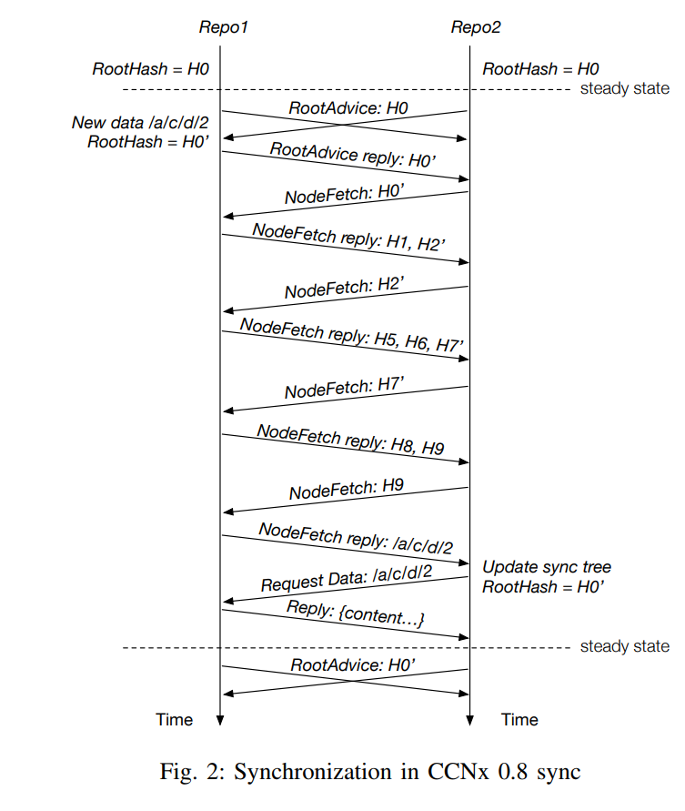

# Dataset Syncrhonization

## [Distributed Dataset Synchronization Survey](https://named-data.net/wp-content/uploads/2017/05/ndn-0053-1-sync-survey.pdf)
- Using NDN differs from TCP in three ways
	1. NDN naturally supports data retrieval among multiple parties, TCP only between two parties
	2. Not all communicating parties must be interconnected
	3. Does not care _from where_ data was obtained as security inherent in data
- Dataset sync boils down to syncrhonization of the namespace in which all data packets live (e.g. /com/stefanolupo/ndngame)
### CCNx 0.8 Sync
- Used to sync collections
- Maintain a tree structure containing the hashses of the data names stored in the tree
- Leaf nodes are just hash(data_name) (eg (`hash("/com/stefanolupo/ndngame/status/stefano")`))
- Parent nodes are the sum of the hashes of their child nodes
- The root node (e.g. `/com/stefanolupo/ndngame/status`) is then a crytographic summary of the dataset
- On update / insertion, root hash recomputed
	- Sync agent periodically advertises latest root hash (`H0`) by sending `RootAdvice` interest to other nodes
		- This is sent over some multicast prefix (e.g. `/coms/stefanolupo/ndngame/broadcast/status/<root_hash_value>`)
	- When sync agent receives `RootAdvice` with hash value different to their own (e.g. `H2` --> `H2'` on remote node):
		- Replies with a `RootAdviceReply` containing their updated root hash value `H0'`
		- Out of date node now knows the updated root hash value `H0'`
		- Sends `NodeFetch` Interest for `H0'` (e.g. `/com/stefanolupo/ndngame/node-fetch/<H0'>`)
		- Gets back the list nodes which are direct children to the root node requested (`[H1, H2']`)
		- If remote child node has same hash as local one, its ignored
			- Otherwise this is recursively done until the names of all the updated / inserted data are discovered
			- Then that data is fetched using standard interests

- Problem: what if 2 different repos update simultaneously
	- There would need to be 2 `RootAdviceReplies` for the same interest (but only the first will be used to satisfy the `RootAdvice`)
	- Solution is the node who published the `RootAdvice` adds the received root hash to an exclude filter and issues the interest again
		- This will then pickup another (if one exists) `RootAdviceReply` while ignoring the one it alread received.
- Problem: data in the sync tree **cannot be deleted** as algorithm cannot distinguish between removal of data and a repo which just hasn't yet received a piece of data (size monotonically grows)

### iSync
- Uses [Invertible Bloom Filter]("misc.md") to store sync state
- Advertises digest of its IBF `digest broadcast` Interest but **doesn't expect a reply** unless someone needs the updated version
	- These just sit in the PIT (which is a little gross)
	- This avoids the problem of multiple replies

### CCNx 1.0 Sync
- Note no actual implementation of this
- Uses (possibly segmented) manifest to store all of the names (or hashes of the names) of the data it contains
- Nodes use interest packets to advertise the hash of its local manifest
- Once node notices a different hash, sends out interests for the new manifest
	- Compares names listed to its own manifest
	- Sends out interests for the data

### CronoSync

- Maintains a sync tree 
	- Each leaf in the tree contains a node's prefix and their current sequence number
		- `hash(prefix + seq#)` represents that node's digest `Di`
		- Root Digest maintained as `hash(D0...Dn)`
- Each node has outstanding long lived interest is sent out for `/<broadcast_prefix>/<root_digest>`
- Aggregated by PITs in routers
- Upon locally producing some new data:
	- Replies to the root digest interest **with the name of the newly published sync data**
		- This differs from CCNx 0.8 which replies with the new root digest
		- Nodes update their local sync tree and send new Interest for new root
		- Then can send out interests for data as nesc
- For efficient state reconcilliation:
	- All nodes maintain a limited log of historical digests and corresponding dataset states
		- Nodes lagging behind will send out interest of an old state digest
		- Nodes can reply with **all** the new data that has been produced since that point
- Cases where node will receive a `SyncInterst` for an unknown digest
	1. Node receives a sync interest with an updated digest before receiving the `SyncReply` from the previous `SyncInterest` that triggered the update
		- ChronoSync adds random delay to unknown interest and reprocesses them later (expecting to receive the `SyncReply` in the mean time)
	2. Multiple nodes publish at the same time can cause multiple `SyncReplies` for the same `SyncInterest`
		- Only one of these `SyncReplies` will reach the node (NDN flow control)
		- Nodes will receive different data items and create different state digests
		- The handling of this is covered in the ChronoSync paper
	3. Network partitions for a long period of time cause the dataset to diverge
		- Basic case when nodes diverge by one SyncReply can be handled as in CCNx Sync 0.8
			- Resend previous interest with an exclude filter for the data already seen
		- This does not work if diverge by a bunch of interest replies
			- Falls back to recovery interest mechanism
			- Nodes finding unrecognised `SyncDigests` send out `RecoveryInterests`
				- Nodes who recognise the digest reply with complete information about its sync tree
				- Requesting node can merge their sync tree into local sync tree by taking the higher sequence number from both trees for each node 
**A LOT OF SIMULTANEOUS DATA GENERATION IS AN ISSUE - PROBABLY NOT A GOOD CANDIDATE FOR MOGS..**

## RoundSync
- Like ChronoSync but segments time into rounds
	- Only one piece of data can be published per node per round
		- This makes the exclussion filter mechanism possible as the only source of reconciliation

## [Lets ChronoSync](http://citeseerx.ist.psu.edu/viewdoc/download?doi=10.1.1.705.8908&rep=rep1&type=pdf)
- BitTorrent Sync service
	- Requires maintenance of P2P network
- Maintain a digest of the current state, exchange it around the network
- Incoming State digest same: no action
- Incoming State digest different
	- We maintain old state digests too so if an incoming state digest is same as an old one, we can figure out the changes that are missing and respond with them
	- Otherwise state reconciliation method can be used to figure out the differences
#### ChronoSync Module
- Maintain a digest tree (eg digest of all the messages in the chatroom)
- Maintain history of dataset state changes (digest log)
- Periodically send out sync interests which contain the digest at rood of digest tree
- Data produced by given producer is numbered sequentially (eg chatroom/alice/56 is Alice's 57th message). The latest of these is known as the **producer status**
- Similar situtation for state digests. These are broadcasted on some prefix so that participants can subscribe (eg .../chatroom/a1234asd9 is the current state digest (digest at end))
- Maintain a digest tree where leaf nodes are **producer statuses**. These are hashed to form digests for each producer (eg one for Alice, one for Bob) which are then hashed to form a single **state digesgt** (Merkle Tree)
- The **digest log** is a list of key value pairs (key == digest, value == diffs from previous state that led to new digest)
	- If participant puts out old state digest, changes can be infered and used as response.
- To maintain state, node continuously have a state interest outstanding (i think)
	- Identical interests are collapsed by NDN routers, meaning during steady state (all nodes agree on state), there will only be one outstanding interest propogated through the network
- On generating a new message, local machines state digest changes and it can then satisfy the current state interest (as its digest is newer / different)
	- Then produces a data packet containing **THE NAME** of the piece of data that caused the state change (**NOT THE ACTUAL DATA**)
		- Other nodes will then receive this (have their interest satisfied) and produce a new state interest with the new digest, returning the system to the steady state
		- If the application **WANTS THE DATA** that caused the state change, it can request it as normal by sending out an interest for it (since it now knows the name from the state-data packet)
- If A and B both simultaneously generate data (respond with state data):
	- One will reach C first (eg B's in this case)
	- Only one piece of data can be returned for given interest in NDN (so C's sync interest satisfied)
	- C repeats sync interest for **previous digest** with exclusion filter set to the hash of B's data that satisfies this interest
		- Network responds with A's sync data allowing C to get all data as required.
- If networks become partitioned (eg A and B cut off from B and C)
	- Sync still works in each of the subnets, but there state sync will diverge
	- On reconnection, digests will not be understood and theres _recovery_ packets to handle this (not exactly sure how)

