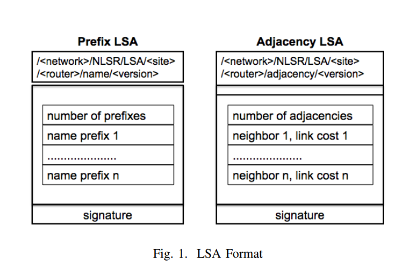
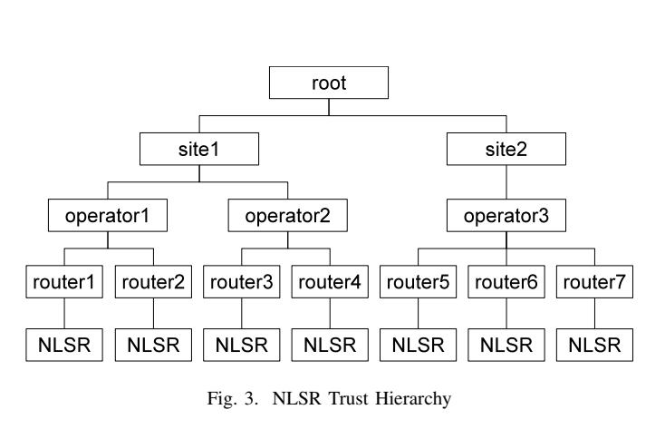

# Routing

## [Secure Link State Routing Protocol for NDN](https://named-data.net/wp-content/uploads/2016/01/ndn-0037-1-nlsr.pdf)
## [First, what is LSR?](http://cnp3book.info.ucl.ac.be/principles/linkstate.html)
- Family of routing protocols. 
- LS routers exchange messages allowing them to learn entire network topology
- Network is modeled as a directed weighted graph
- Each router can then compute its routing table as shortest path (Dijkstra)
- Weights can be set as:
	- Unit  weights (edge weight == number of intermediate routers)
	- Weight proportional to propogation delay
		- Shortest path has smallest propogation delay
	- (C | C > link with max bandwidth) / bandwidth
		- Each node is a factor of max bandwidth
		- Shortest path prefers paths with higher bandwidths
- Same edge can have different weights depending on direction (R1 -> R2 != R2 -> R1)
	- Useful if uplink / downlinks are different
- Routers broadcast HELLO messages on all of their interface ports
	- Enables adjacent routers to discover one and other
- To build up entire topology, LSRs maintain Link State Packets (LSPs)
	- Routes flood their local interfaces with these LSPs when they receive a new one (they're sequence numbered)
	- Flooding is required as these are what is used to _build_ the routing tables so they can't rely on routing tables
### Paper
- Intra domain routing protocol for NDN
	- **INTRA** - inside of a single domain!!!!!!
	- But some of the learnings are applicaple to inter domain routing
- Application level routing protocol
	- Uses NDN Interests / Data to disseminate routing updates
	- Gets all benefits of this (security etc)
- Differs from IP Based LSR
	- Hierarchical naming of routers, keys and routing updates
	- Hierarchical trust model for routing within single domain
	- Routing info dissemination using _ChronoSybc_
	- Multipath routing - way to calculate and rank multiple forwarding options
- NDN routing mechanism needs tu offer multiple next hops
- Must use NDN packets instead of IP packets
- Benefits
	- As routers use hierarchical NDN Names, there is no dependency on communication channel
		- Thus can be used on ethernet, IP, TCP/UDP tunnels etc
	- NDN packets have signature allowing routers to verify routing messages
		- This requires a trust model
	- Multipath forwading:
		- IP must avoid forwading loops, NDN has no such requirement (NDN has built in loop detection (PIT))
		- FIB can thus have multiple next hops for the same name prefix
- As NDN uses a _stateful forwarding plane_
	- The decision of next hop is not soley based on a routing entry
	- Also examines the PIT
	- The PIT also enables routers to measure performance of next hops (e.g. round trip time) as it maintains the state of an interest it has forwarded anyway, unlike in IP which just forwards it on and forgets
- Improvements over previous NLSR
	- uses ChronoSync to distribute Link State Advertisements (LSAs) (probably analgous to LSPs)
	- advertises all the name prefixes originated by a router in one LSA
- ** The routing protocols ranking is important for the initial interest as there may be no measurements yet for that name / next hop ** 
- ** NB: Forwarding strategy defines what the router should do in the case of multiple next hops **
- Some key differences over related protocols in IP land (comparing to [this](A two-layer intra-domain routing scheme for Named Data Networking)) (see P2 of paper)
	- Uses NDN packets as its only communication mechanism
	- Uses ChronoSync to disseminate LSAs while that uses OSPF to figure out shortest path
	- Offers multipath forwarding only if there are _multiple producers_
		- NLSR allows multiple forwarding paths even towards a single producer
- Other NDN Routing protocols don't propogate _all_ of prefix information
	- Instead they try to determine the best one and propogate that
	- This is a problem for NDN as that producer might not have _all_ the data for that prefix
		- Registering a prefix just says that you also have some data to publish under than namespace
		- Others may have some too!
		- This differs to IP routing
			- If an IP router advertises a certain address, it means it can access **all** of the nodes under that address prefix
- Designing routing protocol for NDN is different to IP
	- In IP, any node can push a packet to any other node
	- NDN must be considered in terms of data names and data retrieval
		- Requires naming schemes for routers and routing updates
- Hierarchical Naming Scheme
	- `/<network>/<site>/<router>`
		- `<router>` is split into `<router_tag>/<router_label>`
	- If two routers have the same network prefix, we know they're on the same network
	- If two routers have the same network and site prefix, we know they belong to the same site
	- NLSR process running on a certain router also has a name
		- `<full_router_name>/NLSR`: i.e. `/<network>/<site>/<router>/NLSR`
		- This is used for info messages between adjacent NLSR routers
- LSAs
	- Each node maintains the latest versions of the LSAs in a Link State Database (LSDB)
	- Each router maintains adjacency relations with neighbour routers
		- Publishes a new LSA whenever it detects failure / recovery of a link
	- They also produce prefix LSAs which contain the list of prefixes they are responsible for
	- These are synced using ChronoSync
	- LSAs must have a broadcast prefix
		- As with flooding in IP, this mechanism is what configures routing / forwading
		- This means there may not be any FIB entries setup yet to get a certain LSA
		- Thus when chronosync informs an NLSR process of a new LSA
			- The process creates an interest for the LSA on the broadcast prefix `/<network>/NLSR/LSA/<interest??>`
			- This is then forwarded to all of the _neighbours_ of the node
				- These can respond if they have it in their CS
				- Or it can be forwarded (broadcasted) by the neighbours until it is resolved

- NDN Security
	- Each NDN data packet is signed with an private key.
	- Metadata item indicates the name of the key used to sign the packet
		- Receiver can fetch the key and decrypt the packet
	- Thus, need a trust model for key authentication
- NLSR Trust Model
	- Trust managemnt modeled as a 5 layer hierarchy
	- Single authority responsible for the network (_trust anchor_)
		- Each network has many sites (e.g. router that connects home to ISP, School of Engineering etc)
			- Each site has one or more operators
				- Each operator manages a number of routers
					-	 Each router runs an NLSR process that can produce LSAs
	- The process key used to sign an LSA must be:
		- Signed by corresponding router key,
			- Which in turn should be signed by an operator of the same site's key
				- Which in turn should be signed by the site's  key
					- Which in turn must be signed by the network key (trust anchor)
- **Certs for each key are signed by the key of one level higher in the hierarchy**
- **Network key is self-signed (trust anchor)**

- The key names indicate the role of the key
	- e.g. network key is `/<network>/KEY/<key>`
	- router key is `/<network>/<site>/<router>/KEY/<key>`
	- Note operator key is similar to router key: `/<network>/<site>/<operator>/KEY/<key>`
		- To differentiate between operator and router keys there is two compoonents to this field: tag and label
			- Operator tag : `%C1.Operator`, Router tag: `%C1.Router`
			- The entities label then follows this
	- The key scopes are restricted
		- E.g. operator key can only certify router's belonging to the site to which they both belong
- Key Retrieval:
	- Keys can be queried using Interest / Data as normal
	- Agian, as they must be obtainable _before_ routes are set up
		- Routers can requests keys from all of its direct neighbours
		- If they have it in CS, they will return it.
		- Otherwise they forward it to their neighbours
		- Use a broadcast prefix `/network/broadcast/KEYS` for looking for keys in this way
- Multipath Calculation
	- Using adjacency LSAs from each NLSR node, can build a network topology
	- For an individual direct adjacent neighbour:
		- Run Djikstra to calculate the cost of using that neighbour to reach every other node in the topology
	- Repeat this for each direct neighbour
	- Now have shortest path to get to any node through any of the direct neighbours
	- Rank them according to their cost
	- As we also know the prefixes associated with each router
		- Can obtain a list of next hops to reach each name prefix
- NLSR Hello protocol
	- Periodically send INFO interest to all of its adjacent nodes
	- If this times out to a node, retry a few times in quick succession
		- If still timeout, then link has failed / no has died
		- Mark as inactive from its adjacency list, redistribute LSA, recalculate routing table
	- Also uses _face event notifications_ from the NFD which inform NLSR of when events occur on a certain face
		- Guessing things like sockets closing etc

## Papers to Read / Consider
- Similar to NLSR but for IP [here](A two-layer intra-domain routing scheme for Named Data Networking)
- [ICN Routing](A new approach to namebased link-state routing for information-centric networks)
- [More IP Routing similar to NLSR](Routing to multi-instantiated destinations: Principles and applications)